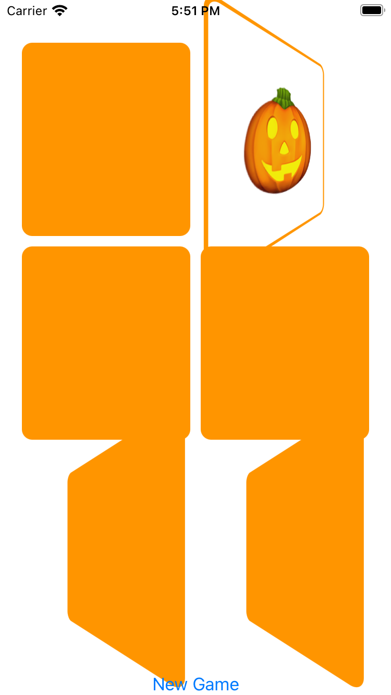

# Memorize

Мобильное приложение, где вам нужно переворачивать карты одну за другой, чтобы найти одинаковые карты. Когда вы найдете две одинаковые карты, вы получите одно очко, и эти карты исчезнут. Игра заканчивается, когда вы найдете все пары.

## **Функционал программы**

• Создание игры: Игра создается с заданным количеством пар карт. Каждая пара состоит из двух карт с одинаковым эмодзи. Эмодзи выбираются из предопределенного списка.

• Отображение карт: Карты отображаются в сетке, где каждая карта имеет свою позицию. Размер и расположение карт определяются на основе размера экрана устройства.

• Выбор карты: Пользователь может выбрать карту, нажав на нее. Если выбранная карта не была ранее открыта или не является частью уже найденной пары, она переворачивается лицом вверх. Если же карта уже была открыта и соответствует другой открытой карте, то они считаются найденными и закрываются.

• Бонусное время: Для каждой открытой карты установлено бонусное время, после истечения которого карта автоматически закрывается, если она не была закрыта ранее. Это добавляет элемент соревнования и стимулирует быстрое поиск пар.

• Перезапуск игры: После завершения игры пользователь может начать новую игру, что приведет к созданию новой парной карты с эмодзи.

## **Скриншоты**

  

## **Стек**
SwiftUI, Combine, MVVM
